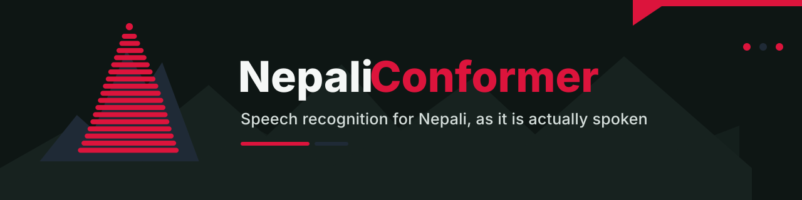

<p align="center">
  
</p>

# NepaliConformer

**Speech recognition for Nepali as it is actually spoken.**

Roughly 33 million people speak Nepali, but speech technology for it has been built and measured
almost entirely on read-aloud recordings. Real Nepali — conversation, spontaneous speech, noisy
rooms, code-switching, and yes, phone lines — is a different language acoustically, and the
systems that top read-speech benchmarks fall apart on it. NepaliConformer is trained on ~1,655
hours of mostly *conversational* Nepali and evaluated on the hardest real-world condition we
could obtain references for. Conformer as the backbone, Nepali at heart: we're bridging that gap
in the open.

**Try it in your browser:** [huggingface.co/spaces/voidash/nepaliconformer](https://huggingface.co/spaces/voidash/nepaliconformer)

Released as a **research prototype** with, we believe, the most honest evaluation any Nepali ASR
system has shipped with: a public real-speech benchmark (**NepTel**), per-system outputs so
every number can be re-derived, and a limitations section that names every measured hole.

## NepTel benchmark — how everything compares

*NepTel is our benchmark; that authorship, and everything about how it was built, is documented in [`benchmark/PROVENANCE.md`](benchmark/PROVENANCE.md).*

NepTel is our benchmark of **real, spontaneous Nepali** (genuine call-center conversations —
the hardest real-world audio there is): 75 segments / 2,375 words with human-reviewed
references. Same audio, same scorer, per-system outputs in
[`benchmark/outputs/`](benchmark/outputs/):

| system | params | WER ↓ |
|---|---|---|
| **NepaliConformer offline (ours)** | 121 M | **33.8** |
| [Kriti](https://github.com/Naamche-Labs/kriti) (Naamche Labs, IndicConformer fine-tune) | 119 M | 40.6 |
| **NepaliConformer streaming (ours, 520 ms)** | 121 M | 59.9 |
| [MMS-1B-all](https://huggingface.co/facebook/mms-1b-all) (Meta, `npi`, zero-shot) | 965 M | 81.0 |
| [IndicWav2Vec-Nepali](https://huggingface.co/sumanpaudel1997/nepali-asr-indicwav2vec) (community mirror) | 94 M | 86.6 |
| [Whisper-large-v3](https://huggingface.co/openai/whisper-large-v3) (zero-shot, anti-hallucination tuned) | 809 M | 99.4 |

The gap over Kriti is +6.8 WER points (95% CI [+3.8, +9.9], paired bootstrap). Full tables,
confidence intervals, methodology and every caveat — including where *we* are weak:
[RESULTS.md](RESULTS.md).

## Read speech (OpenSLR-54)

On a **held-out** 500-utterance slice of OpenSLR-54 (human references, verified absent from the
released model's training corpus): **31.5% WER** (35.6% through a telephony codec chain).

One honesty note, because it matters for comparisons: the remainder of OpenSLR-54 is *inside*
our training data, and published systems that report ~15–24% on SLR54-family test sets were
fine-tuned on those same corpora — read-speech numbers across papers are largely measurements of
in-domain fit. That is exactly why NepTel exists: on held-out *real* speech the ordering above
is what survives.

## Models

| model | params | mode | real-call WER† | HF checkpoint |
|---|---|---|---|---|
| `nepali-conformer-offline` | 121.3 M | full-context | **33.8** | [ampixa/nepali-conformer-offline](https://huggingface.co/ampixa/nepali-conformer-offline) |
| `nepali-conformer-streaming` | 121.3 M | cache-aware, 520 ms lookahead | 59.9 | [ampixa/nepali-conformer-streaming](https://huggingface.co/ampixa/nepali-conformer-streaming) |

**On the NepTel benchmark (constructed and maintained by us — full provenance in [`benchmark/PROVENANCE.md`](benchmark/PROVENANCE.md)), this is the strongest system we have measured:**
ours **33.8** · Kriti 40.6 · MMS-1B 81.0 · Whisper-large-v3 99.4 (same audio, same scorer,
per-system outputs in `benchmark/outputs/`; one gated model still pending access).

†NepTel benchmark: 75 segments / 2,375 words of real Nepali call-center audio, references drafted
by Google Chirp 2 and reviewed word-by-segment by a native speaker. See `benchmark/` and
[RESULTS.md](RESULTS.md) for the full table, confidence intervals, and every caveat.

Both are 17-layer, d=512 Conformer encoders (subsampling ×4, 40 ms frames) with hybrid TDT/CTC
decoders and a 1,024-piece SentencePiece vocabulary, trained **from scratch** on ~1,655 h of
mostly conversational Nepali YouTube speech with Chirp 2 pseudo-labels, augmented with real
telephony codecs (AMR-NB, G.711, G.726, Opus), noise, reverb, and tempo perturbation. The
streaming model uses chunked-limited attention (`[[70,13],[70,6],[70,1],[70,0]]`) with fully
causal convolutions and runs in a cache-aware incremental loop.

## Quickstart

```bash
pip install nemo_toolkit[asr]
python asr/transcribe.py --nemo <checkpoint.nemo> audio.wav
# streaming demo (WebSocket server + browser client):
python streaming/hybrid_stream_server.py --nemo <streaming checkpoint>
```

## The one-paragraph honest summary

On read Nepali speech these models are competitive (~22% WER on OpenSLR-54-style audio). On
**real call audio** the offline model reaches **33.8% WER** — which, for calibration, beats
Whisper-large-v3 zero-shot on the same audio by **66 points** (Whisper: ~99%, it drifts into
Hindi orthography and hallucination loops on phone-band Nepali). The streaming variant pays a
large, measured penalty (59.9%), which decomposes into ~4 points of context restriction and ~19
points of training-lineage damage — details and the experiments behind that decomposition are in
[RESULTS.md](RESULTS.md). Known holes, all measured and quantified: English (the model is
effectively English-deaf beyond Devanagari loanwords), sung/melodic speech (emits at ~¼ its
normal rate), extreme slow speech, and end-of-turn prediction (the EOU token never fires on real
calls; the demo endpoints with energy VAD).

## NepTel benchmark

`benchmark/` contains the reference transcripts, per-model outputs, the scorer, and a fetch
script for the audio (published by [InfoBayAI](https://huggingface.co/datasets/InfoBayAI/Nepali_Call_Center_Audio_Dataset_Dual_Channel)
under CC-BY-4.0; our reference transcripts are CC-BY-4.0). If you have a Nepali ASR system, we
would genuinely like to see your row: run `eval/score_reference.py` and open a PR.

**Do not train on NepTel.** It is an evaluation set. Canary string for contamination checks:
`NEPTEL-CANARY-2026-8f3a1c92`.

## Layout

```
asr/         transcribe CLI, text normalizer (numbers -> spoken words), telephony simulator
eval/        the scorer used for every number in RESULTS.md
streaming/   cache-aware streaming server + browser client
benchmark/   NepTel: references, per-model outputs, fetch script, its own README
RESULTS.md   every measurement, with instruments and caveats
```

## License

Code: MIT. Model weights: **CC-BY-NC**. NepTel references: CC-BY-4.0
(audio © [InfoBayAI](https://huggingface.co/datasets/InfoBayAI/Nepali_Call_Center_Audio_Dataset_Dual_Channel), CC-BY-4.0).

## Citation

If you use the models or the benchmark, cite this repository. A technical report is in
preparation; the full experimental record (immutable one-JSON-per-run results store) backs every
number here.
